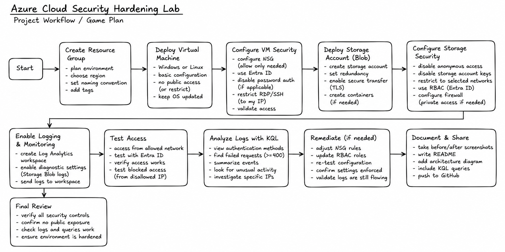

# Azure Cloud Security Hardening Lab

Hands-on Azure security lab focused on hardening cloud resources, implementing identity and network security controls, enabling centralized logging, and analyzing security events with KQL.

## 🌟 Highlights

- Deployed and secured an Azure virtual machine
- Hardened Azure Blob Storage against unnecessary public access
- Implemented Microsoft Entra ID authentication and Azure RBAC
- Restricted network access using Azure security controls
- Enabled diagnostic logging for Azure Storage
- Centralized security logs in Azure Log Analytics
- Used KQL to investigate authentication activity and failed requests
- Validated security controls through access testing and log analysis

## ℹ️ Overview

This project demonstrates the process of taking an Azure environment from deployment through security hardening and validation.

I deployed Azure compute and storage resources, reviewed their security exposure, implemented identity and network-based security controls, and configured centralized logging to provide visibility into activity within the environment.

Rather than stopping after configuration, I validated the environment by generating activity and analyzing the resulting Azure Storage logs using Kusto Query Language (KQL).

The goal was to practice a realistic cloud security workflow:

**Deploy → Assess → Harden → Monitor → Test → Investigate → Validate**

## 🗺️ Project Workflow



The diagram above represents the overall game plan for the lab, from initial resource deployment through security monitoring and validation.

## 🔐 Security Controls

The environment was hardened using several Azure security controls:

- Network Security Groups (NSGs)
- Restricted VM administrative access
- Microsoft Entra ID authentication
- Azure Role-Based Access Control (RBAC)
- Least-privilege permissions
- Disabled anonymous Blob access
- Disabled unnecessary storage account key access
- Secure transfer for Azure Storage
- Storage network access restrictions
- Azure Monitor diagnostic settings
- Centralized Log Analytics logging

## 🔎 Security Monitoring & Analysis

Azure Storage diagnostic logs were forwarded to a dedicated Log Analytics workspace.

This provided visibility into storage operations, authentication methods, failed requests, HTTP status codes, and source IP addresses.

KQL was then used to investigate the collected telemetry.

### Authentication Analysis

```kql
StorageBlobLogs
| summarize Count=count() by AuthenticationType
| sort by Count desc
```

This query identifies which authentication methods are being used to access Blob Storage.

### Failed Request Investigation

```kql
StorageBlobLogs
| where toint(StatusCode) >= 400
| project TimeGenerated, OperationName, AuthenticationType, StatusCode, StatusText, CallerIpAddress
| sort by TimeGenerated desc
```

This provides a chronological view of failed storage requests and their associated source IP addresses.

### Error Analysis

```kql
StorageBlobLogs
| where toint(StatusCode) >= 400
| summarize Count=count() by StatusCode, StatusText, OperationName
| sort by Count desc
```

During testing, the collected telemetry included events such as:

- `403 AuthorizationError`
- `404 ContainerNotFound`
- `404 BlobNotFound`

These logs demonstrated how Azure Monitor and Log Analytics can be used to investigate failed and potentially unauthorized activity.

## 📸 Technical Walkthrough

The complete implementation is documented through screenshots in the [`screenshots`](./screenshots) directory.

Screenshots are numbered in chronological order and document the lab from initial deployment through final security validation.

**Start with `01` and follow the screenshots in numerical order.**

```text
Environment Deployment
        ↓
VM Security
        ↓
Storage Deployment
        ↓
Storage Hardening
        ↓
Identity & RBAC
        ↓
Logging & Monitoring
        ↓
KQL Analysis
        ↓
Security Validation
```

## 🛠️ Technologies

`Microsoft Azure` · `Azure Virtual Machines` · `Azure Storage` · `Microsoft Entra ID` · `Azure RBAC` · `Network Security Groups` · `Azure Monitor` · `Log Analytics` · `KQL`

## 🎯 What I Learned

This project strengthened my understanding of how multiple Azure security controls work together rather than functioning as isolated settings.

The lab provided hands-on experience with reducing cloud attack surface, implementing least privilege, securing storage resources, restricting network exposure, centralizing security telemetry, and using KQL to investigate activity after security controls were implemented.
